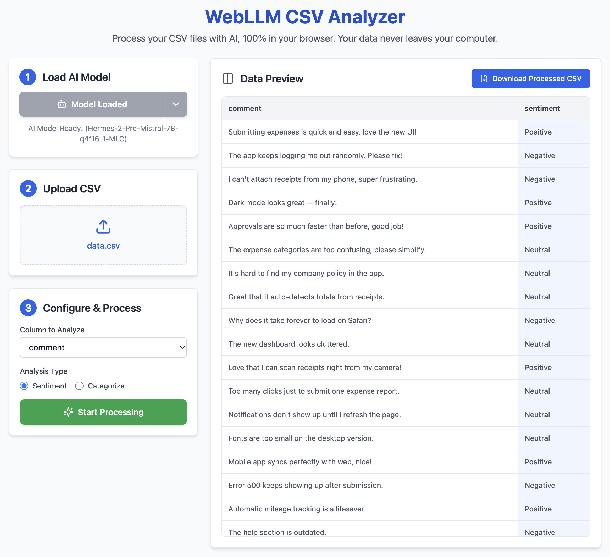

# WebLLM CSV Analyzer



## What it does

This app lets you analyze CSV data using AI models running entirely in your browser. Your data never leaves your computer.

- **Upload CSV**: Load your spreadsheet file
- **Choose AI Model**: Select from multiple models (with VRAM requirements) using the split button
- **Select Column**: Pick which column contains the text to analyze
- **Analysis Type**: 
  - Sentiment: Classifies as Positive, Negative, or Neutral
  - Categorize: Custom categories with your own prompt
- **Process**: AI analyzes each row in the background
- **Download**: Get the CSV with added analysis columns

## How to use

1. Click "Load Model" to load the default AI model, or use the dropdown to choose another
2. Upload your CSV file
3. Select the column to analyze
4. Choose sentiment or enter custom categories
5. Click "Start Processing" and wait for the progress bar
6. Download the analyzed CSV

## Local development

```bash
# install deps
yarn install

# start dev server (http://localhost:5173)
yarn dev
```

Note: Dev server includes headers for Cross-Origin Isolation to support WebLLM.

## Deploy to Netlify

1. Push this repo to GitHub
2. In Netlify, create a new site from Git and select this repo
3. Build Command: `yarn build`
4. Publish Directory: `dist`

Headers in `netlify.toml` enable cross-origin isolation for WebLLM.

## Notes

- Uses WebLLM for browser-based AI inference
- Supports WebGPU where available (Chrome/Edge recommended)
- Simple CSV parser handles quoted fields
- Built with Vite + React + Tailwind